### 1. Membuat dokumen HTML dengan nama file lab5_javascript.html
```html
<!DOCTYPE html>
<html lang="en">
<head>
    <meta charset="UTF-8">
    <meta http-equiv="X-UA-Compatible" content="IE=edge">
    <meta name="viewport" content="width=device-width, initial-scale=1.0">
    <title>Mengenal Javascript</title>
</head>
<body>
    <h1>Pengnalan Javascript</h1>
    <h3>Contoh document.write dan console.log</h3>
    <script>
        document.write("Hello World");
        console.log("Hello World")
    </script>
</body>
</html>
```

### _Berikut adalah tampilan hasilnya:_
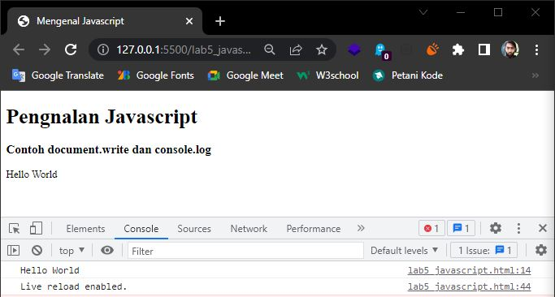

### 2. Pemakaian Alert sebagai property window
```html
<!DOCTYPE html>
<html lang="en">
<head>
    <meta charset="UTF-8">
    <meta http-equiv="X-UA-Compatible" content="IE=edge">
    <meta name="viewport" content="width=device-width, initial-scale=1.0">
    <title>Alert Box</title>
</head>
<body>
    <script language="Javascript">
        window.alert("ini adalah pesan untuk anda");
    </script>
</body>
</html>
```

### _Berikut adalah tampilan hasilnya:
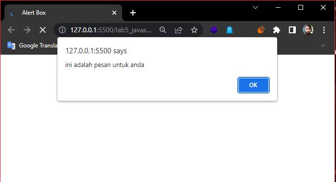

### 3. Pemakaian method dalam objek
```html
<!DOCTYPE html>
<html lang="en">
<head>
    <meta charset="UTF-8">
    <meta http-equiv="X-UA-Compatible" content="IE=edge">
    <meta name="viewport" content="width=device-width, initial-scale=1.0">
    <title>Alert Box</title>
</head>
<body>
    <script language="Javascript">
        window.alert("ini adalah pesan untuk anda");
    </script>
</body>
</html>
```

### _Berikut adalah tampilan hasilnya_:
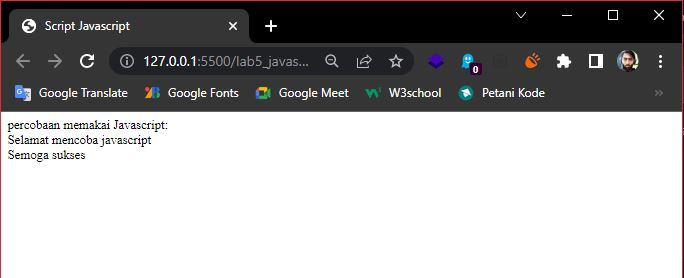

### 4. Pemakaian Prompt
```html
<!DOCTYPE html>
<html lang="en">
<head>
    <meta charset="UTF-8">
    <meta http-equiv="X-UA-Compatible" content="IE=edge">
    <meta name="viewport" content="width=device-width, initial-scale=1.0">
    <title>Pemasukan Data</title>
</head>
<body>
    <script Language="Javascript">
        var nama=prompt("siapa nama anda?","masukan nama anda");
        document.write("hai, "+ nama);
    </script>
</body>
</html>
```

### _Berikut adalah tampilan hasilnya:_
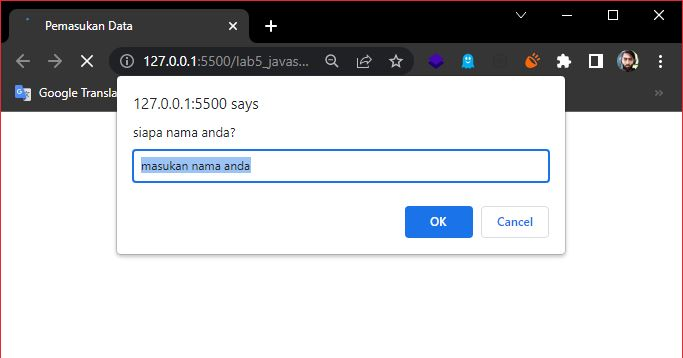
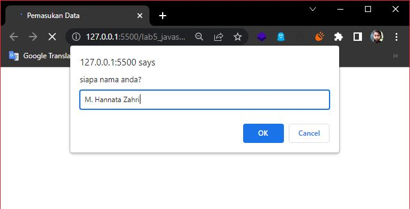
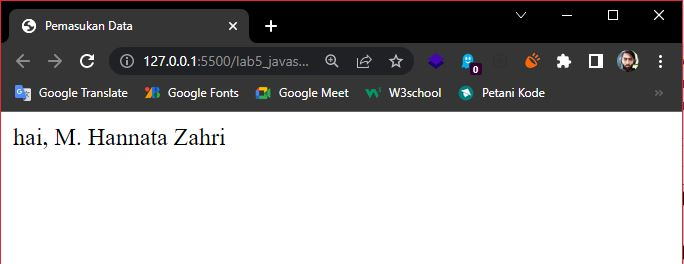

### 5. Pemakaian fungsi dan cara pemanggilannya
```html
<!DOCTYPE html>
<html lang="en">
<head>
    <meta charset="UTF-8">
    <meta http-equiv="X-UA-Compatible" content="IE=edge">
    <meta name="viewport" content="width=device-width, initial-scale=1.0">
    <title>Pemasukan Data</title>
    <script Language="Javascript">
        function pesan(){
            alert("memanggil Javascript lewat body onload")
        }
    </script>
</head>
<body onload=pesan()>

</body>
</html>
```

### _Berikut adalah tampilan hasilnya:_
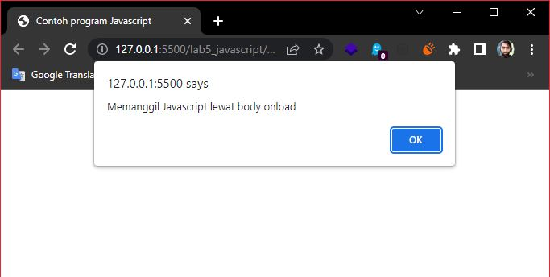

### 6. Operasi dasar aritmatika
```html
<!DOCTYPE html>
<html lang="en">
<head>
    <meta charset="UTF-8">
    <meta http-equiv="X-UA-Compatible" content="IE=edge">
    <meta name="viewport" content="width=device-width, initial-scale=1.0">
    <title>Contoh program Javascript</title>
    <script Language="Javascript">
        function test(val1,val2)
        {
            document.write("<br>"+"perkalian : val1*val2"+"<br>")
            document.write(val1*val2)
            document.write("<br>"+"Pembagian : val1/val2"+"<br>")
            document.write(val1/val2)
            document.write("<br>"+"penjumlahan : val1+val2"+"<br>")
            document.write(val1+val2)
            document.write("<br>"+"pengurangan : val1-val2"+"<br>")
            document.write(val1-val2)
            document.write("<br>"+"modulus : val1%val2"+"<br>")
            document.write(val1%val2)
        }
    </script>
</head>
<body>
    <input type="button" name="button1" value="aritmetic" onclick=test(9,4)>
</body>
</html>
```

### _Berikut adalah tampilan hasilnya:_
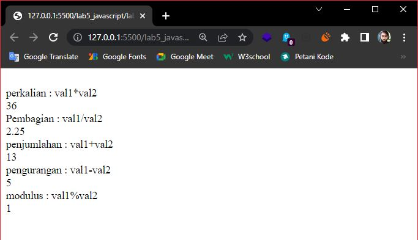

### 7. Seleksi kondisi (if..else)
```html
<!DOCTYPE html>
<html lang="en">
<head>
    <meta charset="UTF-8">
    <meta http-equiv="X-UA-Compatible" content="IE=edge">
    <meta name="viewport" content="width=device-width, initial-scale=1.0">
    <title>Contoh if..else</title>
</head>
<body>
    <script Language="Javascript">
        var nilai = prompt("nilai (0-100): ", 0);
        var hasil = "";
        if (nilai >=60)
        hasil = "lulus";
        else
        hasil = "tidak lulus";
        document.write("hasil: " + hasil);
    </script>
</body>
</html>
```

### _Berikut adalah tampilan hasilnya:_
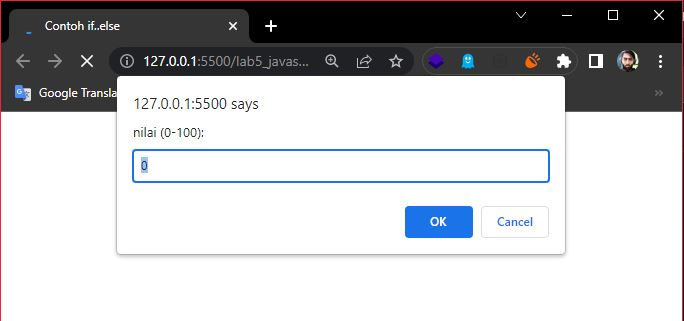
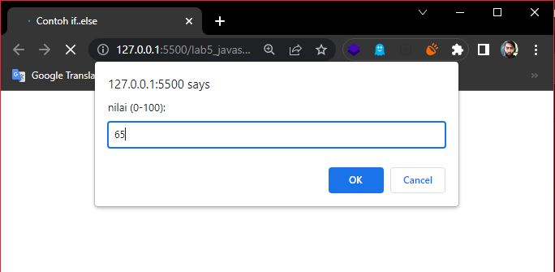
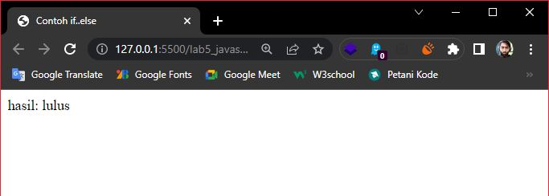

### 8. Penggunaan operator switch untuk seleksi kondisi
```html
<!DOCTYPE html>
<html lang="en">
<head>
    <meta charset="UTF-8">
    <meta http-equiv="X-UA-Compatible" content="IE=edge">
    <meta name="viewport" content="width=device-width, initial-scale=1.0">
    <title>Contoh if..else</title>
    <script Language="Javascript">
        function test()
        {
            val1=window.prompt("input nilai (1-5):")
            switch (val1)
            {
                case "1" :
                    document.write("bilangan satu")
                    break
                case "2" :
                    document.write("bilangan dua")
                    break
                case "3" :
                    document.write("bilangan tiga")
                    break
                case "4" :
                    document.write("bilangan empat")
                    break
                case "5" :
                    document.write("bilangan lima")
                    break
                default :
                    document.write("bilangan lainnya")
            }
        }
    </script>
</head>
<body>
    <input type="button" name="button1" value="switch" onclick=test()>
</body>
</html>
```

### _Berikut adalah tampilan hasilnya:_
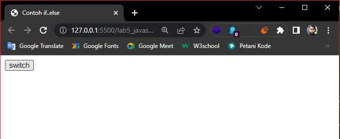
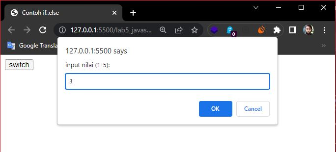
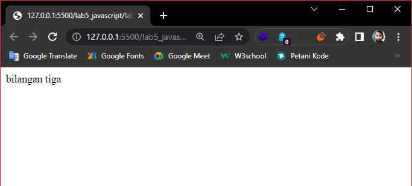
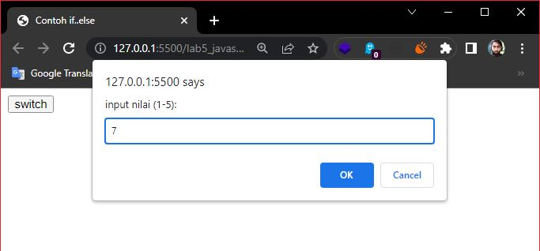
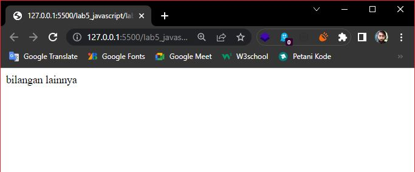

### 9. Pembuatan form input
```html
<!DOCTYPE html>
<html lang="en">
<head>
    <meta charset="UTF-8">
    <meta http-equiv="X-UA-Compatible" content="IE=edge">
    <meta name="viewport" content="width=device-width, initial-scale=1.0">
    <title>Contoh if..else</title>
    <script Language="Javascript">
        function test(){
            var val1=document.kirim.T1.value
            if (val1%2==0)
                document.kirim.T2.value="bilangan genap"
            else
                document.kirim.T2.value="bilangan ganjil"
        }
    </script>
</head>
<body>
    <form action="" method="post" name="kirim">
        <p>BIL <input type="text" name="T1" id="T1" size="20">Merupakan BIL <input type="text" name="T2" id="T2" size="20"></p>
        <p><input type="button" value="TEBAK" name="B1" onclick=test()></p>
    </form>
</body>
</html>
```

### _Berikut adalah tampilan hasilnya:_
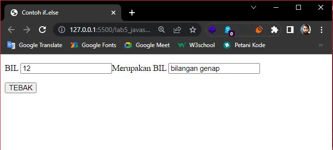

### 10. Pembuatan form button
```html
<!DOCTYPE html>
<html lang="en">
<head>
    <meta charset="UTF-8">
    <meta http-equiv="X-UA-Compatible" content="IE=edge">
    <meta name="viewport" content="width=device-width, initial-scale=1.0">
    <title>Contoh if..else</title>
</head>
<body>
    <script Language="Javascript">
        function ubahWarnaLB(warna){
            document.bgColor = warna;
        }
        function ubahWarnaLD(warna) {
            document.fgColor = warna;
        }
    </script>
    <h1>Test</h1>
    <form action="">
        <input type="button" value="Latar Belakang Hijau" onclick="ubahWarnaLB('GREEN')">
        <input type="button" value="Latar Belakang Putih" onclick="ubahWarnaLB('WHITE')">
        <input type="button" value="Teks Kuning" onclick="ubahWarnaLD('YELLOW')">
        <input type="button" value="Teks Biru" onclick="ubahWarnaLD('BLUE')">
    </form>
    <script language="javascript">
        document.write("Dimosidikasi terakhir pada" + document.lastModified)
    </script>
</body>
</html>
```

### _Berikut adalah tampilan hasilnya:_
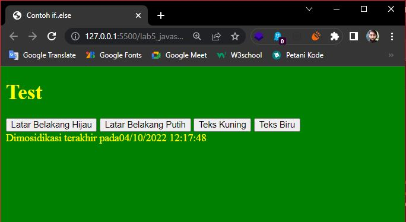
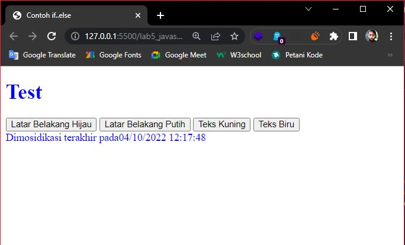

### 11. Pilihan menggunakan checkBox dengan perhitungan otomatis
```html
<!DOCTYPE html>
<html lang="en">
<head>
    <meta charset="UTF-8">
    <meta http-equiv="X-UA-Compatible" content="IE=edge">
    <meta name="viewport" content="width=device-width, initial-scale=1.0">
    <title>Contoh if..else</title>
    <script Language="Javascript">
        function hitung(ele){
            var total = document.getElementById('total').value;
                total = (total ? parseInt(total) : 0);
            var harga = 0

            if (ele.checked){
                harga = ele.value;
                total +=parseInt(harga)
            }
            else {
                harga = ele.value;
                if (total > 0)
                    total -=parseInt(harga);
            }
            document.getElementById('total').value = total;
        }
        function ubahWarnaLD(warna) {
            document.fgColor = warna;
        }
    </script>
</head>
<body>
    <h1>Daftar Menu Makanan</h1>
    <label><input type="checkbox" value="5000" name="menu1" id="menu1" onclick="hitung(this);">Ayam Goreng Rp.5000</label>
    <br>
    <label><input type="checkbox" value="500" name="menu2" id="menu2" onclick="hitung(this);">Tempe Goreng Rp.500</label>
    <br>
    <label><input type="checkbox" value="2500" name="menu3" id="menu3" onclick="hitung(this);">Telur Dadar Rp.2500</label>
    <hr>
    <strong>Total Bayar: Rp.<input type="text" name="total" id="total"></strong>
</body>
</html>
```

### _Berikut adalah tampilan hasilnya:_
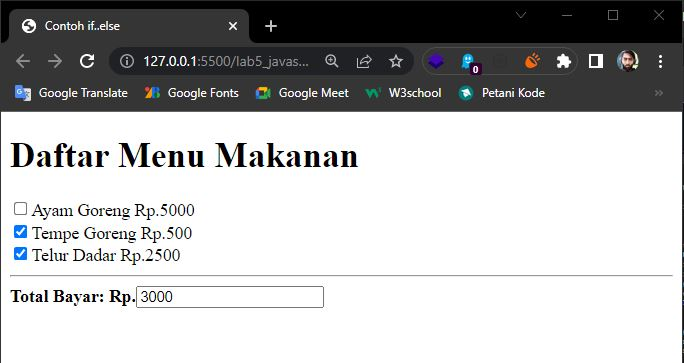